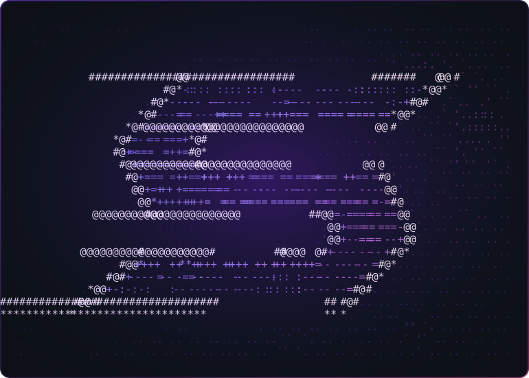

<table>
<tr>
<td width="46%" valign="top">

### Sammy &nbsp;`@SammyNashed`

**Android &amp; systems developer** — Kotlin, Jetpack Compose, local LLMs. 
Aleppo, Syria &nbsp;·&nbsp; UTC+03:00

<a href="https://github.com/SammyNashed?tab=repositories">Repositories</a> &nbsp;·&nbsp;
<a href="https://www.linkedin.com/in/sammy-nashed-480aaa318/">LinkedIn</a> &nbsp;·&nbsp;
<a href="mailto:nashedsammy@gmail.com">Email</a>

</td>
<td width="54%" valign="top">

</td>
</tr>
</table>

---

### About

IT student building software that ships as an actual product, not a demo.
Most of my time goes into Android — Kotlin and Jetpack Compose, offline-first,
no ads, no telemetry — and into Windows tooling that removes friction from my
own workflow. Currently working through local model inference (Llama 3.1 via
Ollama) and how to make prompt-driven features behave deterministically enough
to ship.

Comfortable in the parts that are not fun: state modelling, persistence,
packaging, and making a build reproducible on someone else's machine.

 

### Currently building

<table>
<tr>
<td width="60%" valign="top">

#### [Emran](https://github.com/SammyNashed/Emran) &nbsp;Kotlin · Jetpack Compose

A private, offline-first Islamic prayer and **Qada** tracker for Android.
Glassmorphic UI, habit mechanics with recovery targets and milestone resets,
and a persistence layer that keeps years of history local to the device.
Distributed as a signed APK through Releases.

</td>
<td width="40%" valign="top">

**Focus right now**

- Qada recovery engine &amp; milestone resets
- Compose motion / state restoration
- Release pipeline and APK signing

</td>
</tr>
</table>

 

### Tech

 

### Selected projects

<table>
<tr>
<td width="50%" valign="top">

**[Emran](https://github.com/SammyNashed/Emran)** &nbsp;`Kotlin`

Offline-first prayer and Qada tracker for Android. Compose UI, local
persistence, habit-recovery mechanics, shipped as an installable APK.

</td>
<td width="50%" valign="top">

**[zen-pwa-automator](https://github.com/SammyNashed/zen-pwa-automator)** &nbsp;`PowerShell`

Unlocks native PWA support in Zen Browser: unattended background install,
smart link routing and borderless window management.

</td>
</tr>
<tr>
<td width="50%" valign="top">

**[Trichyguard-AI](https://github.com/SammyNashed/Trichyguard-AI)** &nbsp;`in progress`

Applied-ML experiment around local inference — early, moving slowly and
deliberately.

</td>
<td width="50%" valign="top">

**[All repositories →](https://github.com/SammyNashed?tab=repositories)**

Tooling, browser experiments and Android work in various states of finished.

</td>
</tr>
</table>

 

### Statistics

<table>
<tr>
<td width="50%" valign="top">

</td>
<td width="50%" valign="top">

</td>
</tr>
</table>

Every card above is generated on request — the numbers stay current on their own.
